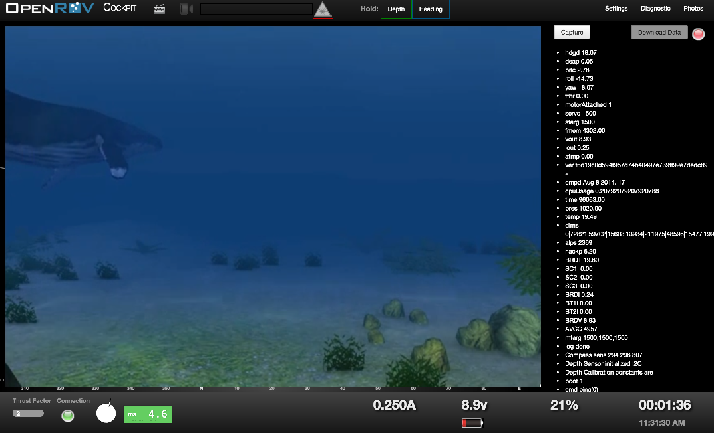
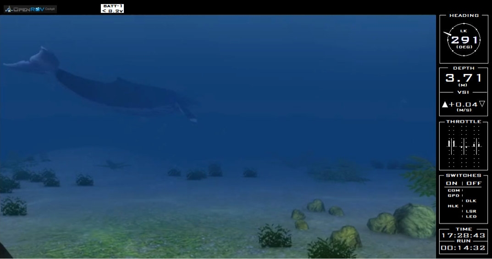
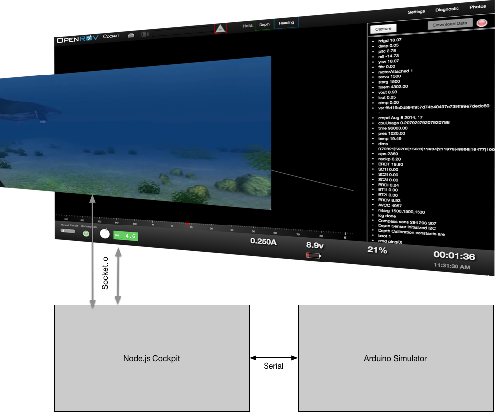

Design Document: Integrated unity simulator with openrov cockpit

Purpose: To provide a simulator that can be used to train pilots on flying underwater ROVs.  Additionally to provide a testing feedback simulator for OpenROV controls.

Approach:  The unity simulated envionment will contain the physics enginge and flight characterstics of the OpenROV.  The environment will allow for the addition of interesting things to see such as fish and land forms.  The units player will be embeded in the OpenROV cockpit webpage.  The OpenROV cockpit will replace the video element of the interface with the unity player.  The cockpit will continue to send commands via socket.IO to the node.js process for cockpit which can be run locally.  The node.js process will talk via a virtual serial port to a virtual arduino that is running simulated in user space.  The node.js process will pass the serial responses that show the actions that the arduino firmware is taking on physical surfaces and motors of the ROV. Thata information will then be sent via Socket.IO to the unity player running within the Cockpit page where it will be processed by the phsics engine and simulator within Unity.  The simulator, having references to the physical world model, will pass back pressure and orientation information back to the Arduino via a new set of serial commands that are housed by simulated sensor plugins.

The overall experience will be flying the ROV via cockpit just like normal but with the camera feedback and telemetry provided by the unity simulator.

This architectural approach allows for swapping in different community UI themes with the simulator with no additional work.

Value:

1. The simulator should allow for rudimentary validation of the flight characterstics of different types of ROVs lowering the over development cost by reducing the number of phyiscal iterations of canidate desings
2. When changing code, developers that do not have real ROVs should be able to reliably predict and verify the effects of there changes in code.  This will support scaling the development community while keeping quality of the software ultimatly allowing faster feature development
3. Will spread the word about OpenROV by allowing schools and researchers to get excited about using an ROV that really models how they opperate in real-life. It should allow for increased press and social recognition of ROV increasing sales.
4. Place OpenROV in a thought leadership position in underwater exploration on ROV development.  This assumes there are no accessible simulators on the market today.  
5. Increase the quality of third party add-ons to OpenROV. Things like simulator arms now have a way to be simulated with different ROVs, and the interaction controls can largly be developed in the simulator without having to physically build what may be expensive and time consuming early iterations.
